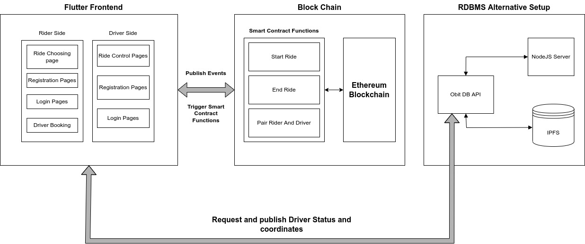

# A decentralized ride-hailing system built using blockchain and IPFS

Junior year capstone project completed in requirement of the *Innovative Product Development* course.

Team:

- [Om Naik](https://github.com/nike1421)
- [Nimai Patel](https://github.com/nimaipatel) (me)

Advisor and mentor:
Asst. Prof. Harshal Dalvi

# Paper

A paper produced as part of this project is accepted for publication in [IBSSC 2022](https://www.ieeebombay.org/ibssc2022/).
It will be published in IEEE Xplore.

# Build and deploy

The mobile app can be built like any Flutter + Dart project. Refer to [Flutter documentation](https://docs.flutter.dev/).

For deploying the smart contracts, move to the `contracts` folder and execute `truffle compile && truffle migrate`.

The relay-server can be deployed using `npm run start`.

# System architecture

